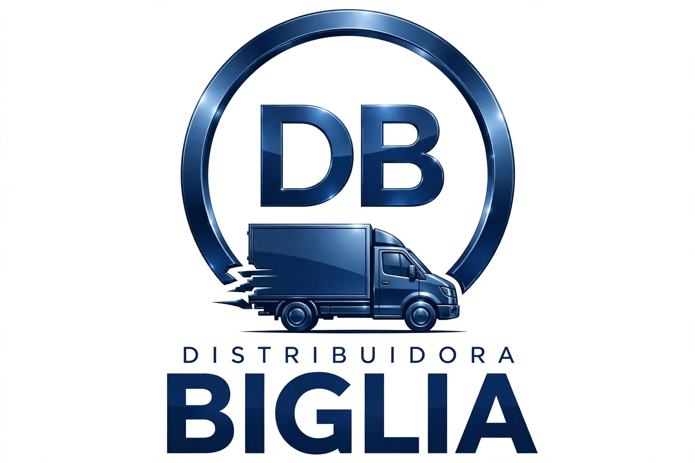

# Distribuidora BIGLIA - App Preventista 2.0

App PWA para preventistas. Azul y blanco, logo DB circular con camioneta.

## Logo oficial


- DISTRIBUIDORA en small caps
- BIGLIA gigante bold
- DB + camioneta rompiendo el círculo

## Como usar

```bash
npm install
npm run dev
```

Subir a GitHub:
```bash
git init
git add .
git commit -m "Distribuidora Biglia v2"
git remote add origin TU_REPO
git push -u origin main
```

Deploy en Vercel / Netlify: solo conecta el repo, hace build automático.

## Estructura
- src/components/Header.tsx - Header corporativo
- src/components/Login.tsx - Login con clave 1234
- src/components/PedidosList.tsx - Lista pedidos con stats
- src/components/NuevoPedido.tsx - Form nuevo pedido
- src/components/Catalogo.tsx - ABM productos
- src/components/Clientes.tsx - ABM clientes
- src/hooks/useLocalStorage.ts - Persistencia
- src/assets/logo.png - Logo oficial
